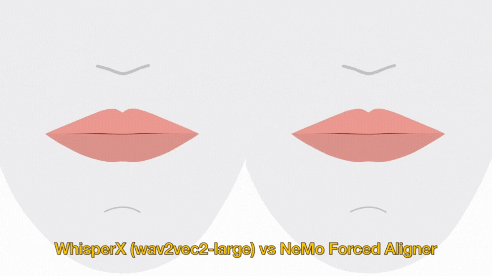

# Artist-Driven Auto Lip Sync Blender Add-on

### Generating first-pass lip sync animation from audio using ML phoneme extraction and user-defined mouth shapes.
Animating lip sync is a repetitive and time-consuming process in character animation. To animate dialogue, animators manually place and adjust mouth shapes by ear to match the audio.

This project accelerates that workflow by combining automatic phoneme extraction with artist-defined viseme-blendshape mappings, producing a usable animation pass directly inside Blender.

## An Animator-Oriented Approach
Instead of replacing artistic control, this tool is designed to:
- Reduce the manual workload of lip sync animation
- Accelerate animation blocking by providing a strong starting point for refinement
- Keep artists in control of the final performance

## Key Features (WIP)
- 🎤 Audio-to-viseme generation from dialogue input (supports audio files <25 MB)
- 🎭 Custom viseme mapping using user-defined blendshapes
- 🎞️ Automatic keyframe generation in Blender's timeline
- ⚙️ CPU and GPU support (PyTorch backend)
- 🇺🇸 American English phoneme support

### Viseme Mapping Prototype Demo
[](https://vimeo.com/1181858864?fl=pl&fe=sh)

<i>This video compares two alignment methods: WhisperX (left) and NVIDIA NeMo Forced Aligner (right). 
The add-on uses WhisperX, which provides better timing and alignment in these tests.</i>

## ⚠️ Project Status
This project is currently a work in progress.

- The audio-to-viseme pipeline is functional
- The Blender UI is under active development and not yet connected to the backend pipeline

Current usage requires running the pipeline via script rather than through the Blender interface.

## How to Try It

### Option 1: View the Demo
Watch the pipeline results (WhisperX method) [here](https://vimeo.com/1181858864?fl=pl&fe=sh).

### Option 2: Run the Pipeline Locally

#### Requirements
- Python 3.11
- FFmpeg
- (For GPU acceleration) GPU with CUDA 12.8 compatibility

#### Setup (Tested on Windows)
1. Clone the repository
```
git clone https://github.com/atongsak/auto-lip-sync.git
cd auto-lip-sync
```

2. Create a virtual environment
```
py -3.11 -m venv .venv
.\.venv\Scripts\Activate.ps1
```

3. Upgrade pip
```
pip install --upgrade pip
```

#### GPU Installation (CUDA 12.8)
```
pip install torch==2.8.0 torchvision==0.23.0 torchaudio==2.8.0 --index-url https://download.pytorch.org/whl/cu128
pip install "transformers>=4.48.0"
pip install "huggingface-hub<1.0.0"
pip install tokenizers
pip install whisperx==3.8.5 --no-deps
pip install numpy scipy pandas tqdm librosa soundfile
pip install faster-whisper
pip install omegaconf nltk
pip install pyannote.audio
pip install torchcodec==0.7.0
```

#### CPU Installation
```
pip install "transformers>=4.48.0"
pip install "huggingface-hub<1.0.0"
pip install tokenizers
pip install whisperx==3.8.5
```

#### Additional Dependencies
```
winget install eSpeak-NG.eSpeak-NG --silent
pip install py-espeak-ng phonemizer
```

#### Run the Pipeline
```
python .\new_audio_to_phoneme.py
```

## Team/Contact
Annette Tongsak (annettetongsak@gmail.com)

For issues or feedback, please open a GitHub issue.

## Acknowledgements
This work utilizes [WhisperX](https://github.com/m-bain/whisperX) for audio transcription and forced alignment. 

[Phonemizer](https://github.com/bootphon/phonemizer) with [espeak-ng backend](https://github.com/espeak-ng/espeak-ng) is used to convert detected transcripts to IPA phonemes.